# 1.  Lets Start! With Creating a File
We have to add Thai glpyhs into the file (glyphs with its unicode). There are two ways of doing this in Glyphs 3: 

1.1 First opening Glyphs App, there will be a window showing different scripts for you to choose which script you want to develop, then select Thai and say _YES_ to _Prepare glyphs_

1.2 We can also come to the languages section on the left, then we open the dropdown in Thai and then selected the glyphs we would like to add from those catagories (Letters, Marks, Numerals etc.) then click "Generate"

## Note: For first time user
Before diving into editing, there are some modules you need to install for the future plugins to work. You can access them through _Window > Plugin Manager_ 
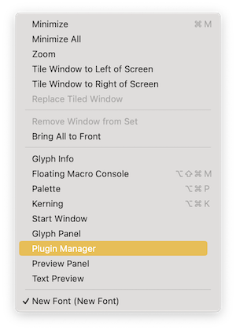

Then this window will appear. Go to _Modules_ located next to the search box. Then install all 4 modules, also for the future use ;-)

Please see more about modules also in [Glyphs 3 Handbook](https://cdn2.glyphsapp.com/media/pages/learn/f84e457b88-1639830290/glyphs-3.0.4-handbook.pdf) (in 3.6 Addons)

# 2. Metric & Alignment Zones for Thai
After we added Thai glyphs into our file, it's time to define body height and alignment zones — please see more about techniccal details explanation in [Glyphs 3 Handbook](https://cdn2.glyphsapp.com/media/pages/learn/f84e457b88-1639830290/glyphs-3.0.4-handbook.pdf). This is useful as the rest of the consonants will have heights to depend on and the vowels and tones will be easier to position. 

**Thai's height is situated in between Cap Height and x-Height.** 

To do this, you can go to  _Font Info_. Then go to _Masters_ tab, scroll down to _Metrics_ and click the _+_ symbol on the right.

If you added Thai glyphs through pre-defined glyphs set via the scripts pop-up window, you will automatically have multiple Metrics preset here. You can choose to keep/ modify/ delete them out as you see fit for your design. 

In this insturction, we would like to keep the metricminimal for ease of understanding. And will only focus on what is necessary. We started by adding the glyphs through method (1.1) 

A new _undefined_ input will appear. Simply click on it, then choose _Body Height_ for the _Metrics type_ and add a _Custom Name_. In this example, I put Thai.

Then you can fill in Thai height and alignment zone. These values can be changed along your development process. They are important also for anchors attachment at Thai height in which we will talk about it more in details in the section below. 

# Start Drawing! 
You will be filling all glyphs with your drawing in most of the sections: Letters, Marks, Numerals and others, please see more about [the drawing tip here](https://glyphsapp.com/learn/drawing-good-paths)

## Marks
After you've done all Letters, now you can start drawing the vowel! `saraIi-thai` is usually good for the start as its height usually defines the rest of its set (`saraI-thai` `saraIi-thai` `saraUe-thai` `saraUee-thai`). You can also add 2 guidelines to easily refer to the baseline and height of saraIi.

# About Thai Tones and Vowels
Because of how Thai tones and vowels can be placed, there usually need to be more than one glyphs for each tone and vowel. 

### Top Tones and Vowels
In the case of _top tones and vowels_, there are usually
- default glyphs or normal glyphs with unicodes for the 1st floor tones and all vowels (as grammatically tones can be on top of vowels but not the other way around);
- glyphs with their names followed by ".small" for the 2nd floor tones or tones that are placed on top of vowels;
- glyphs with their names followed by ".narrow" for all tones and vowels used with ascender letters: poPla, foFa, foFan or in some case narrow letters such as roRua, woWean, khoKhai, choChang etc.

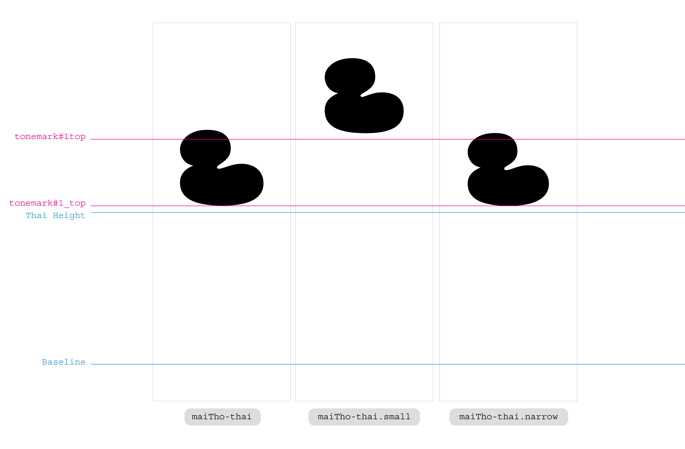
An example of maiTho, maiTho.small and maiTho.narrow

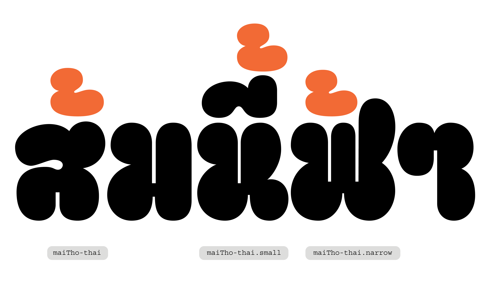
An example of maiTho, maiTho.small and maiTho.narrow in use

<!-- 

An example of default maiTho

An example of maiTho.small

An example of maiTho.narrow -->

> [!NOTE]
> Not all tones may have all kinds of glyphs. This can be adjusted depending on the needs within a typeface. If non of the above glyphs fits, you can also create ".mid" width tones.

### Bottom Vowels
In the case of _bottom vowels_, there are usually
- default glyphs or normal glyphs with unicodes for all vowels;
- glyphs with their names followed by ".small" for ".short" descender letters: doChada and ToPatak.

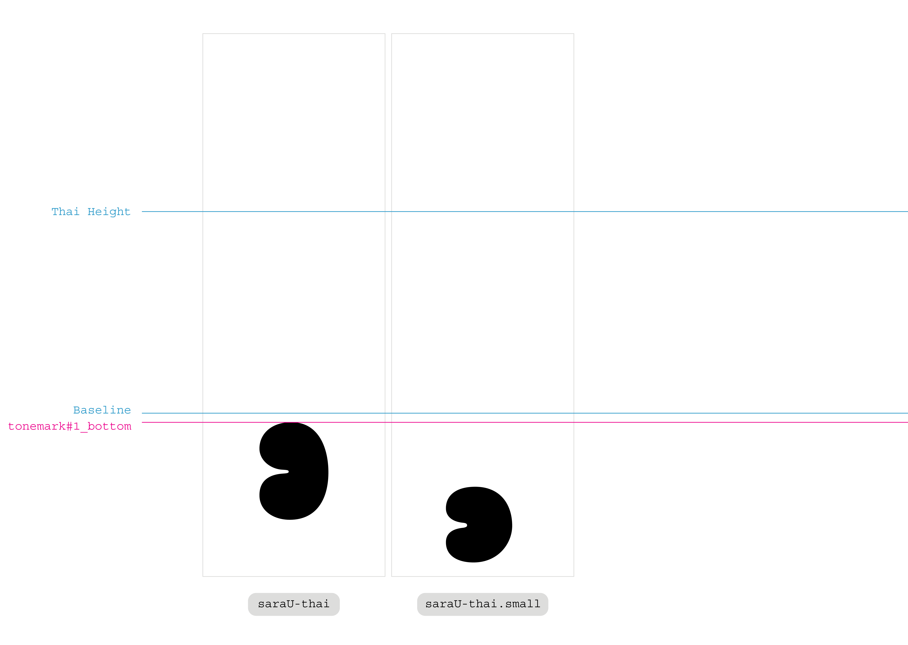
An example of saraU and saraU.small

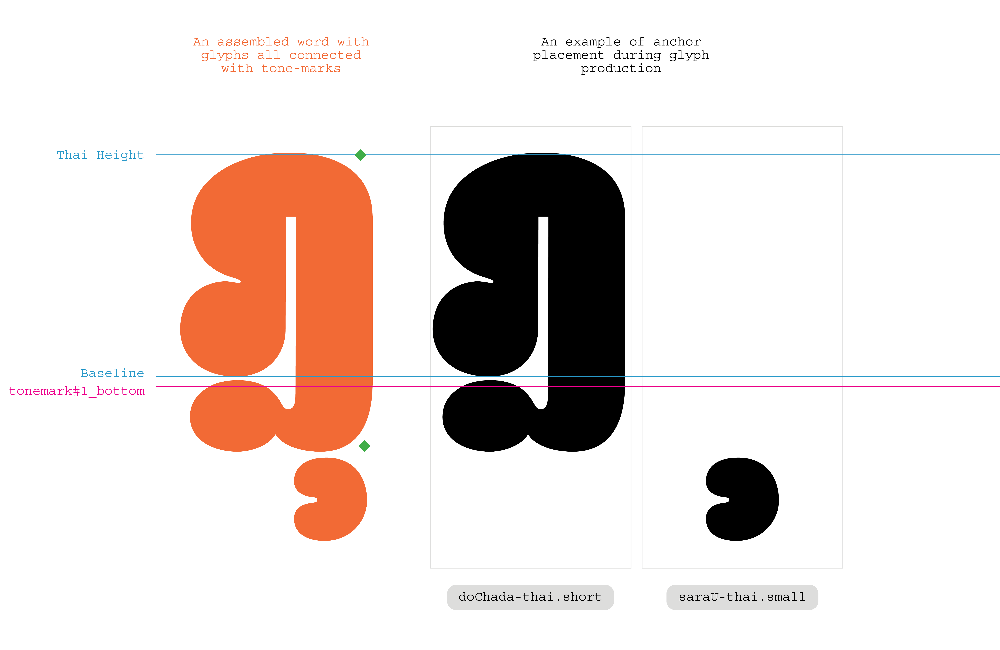
An example of doChada.short and saraU.small in use

<!-- 
An example of saraU and saraU.small

An example of saraU.small -->

# About Tone-Marks
All the tones and vowels are connected to consonants with anchors called "marks." These marks act like hooks that you can place on each glyph for them to hook to another glyph. 

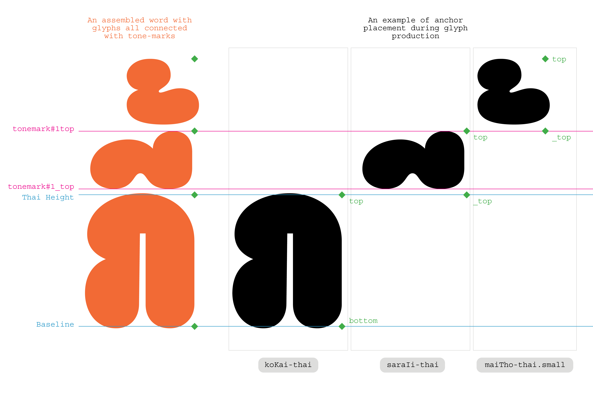

There are 2 marks placed on consonants namely _top_ and _bottom_, and they , like their names, connect to top tones or vowels and bottom vowels consecutively. You can place tone-marks on the top and bottom right corners of each consonant. 

Though it is good to note that for rounded corners of some letters, tone-marks need to be shifted inward a little bit, as in the top tone-mark in this example. 
<!-- 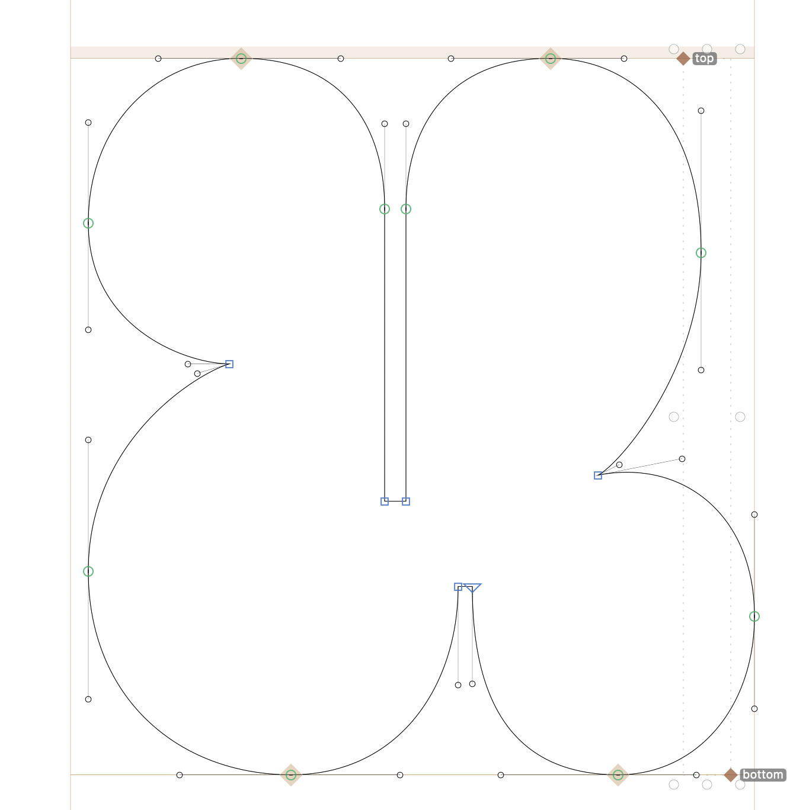
top tone-mark on the top right corner of the image and bottom tone-mark on the bottom right corner of the image -->

For the top tones and vowels, there are also 2 marks and are called *top* and *_top*. It is recommended to add marks on the top and bottom of each tone and vowel, eventhough some tones are not grammatically be topped with anything. This is just to prevent user errors.
<!-- 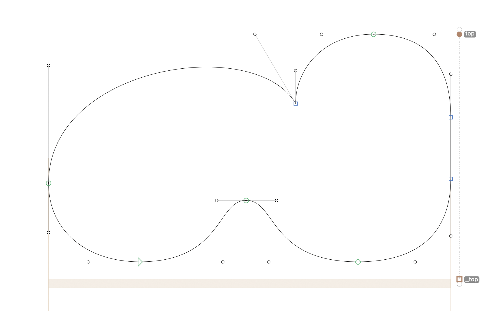
top tone-mark on the top right corner of the image and _top tone-mark on the bottom right corner of the image -->

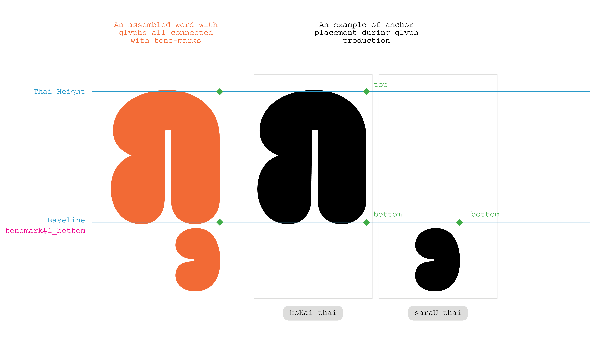

For bottom vowels, there is only 1 tone-mark to connect to the consonant above as there is nothing beneath these vowels. This tone-mark is called *_bottom*.
<!-- 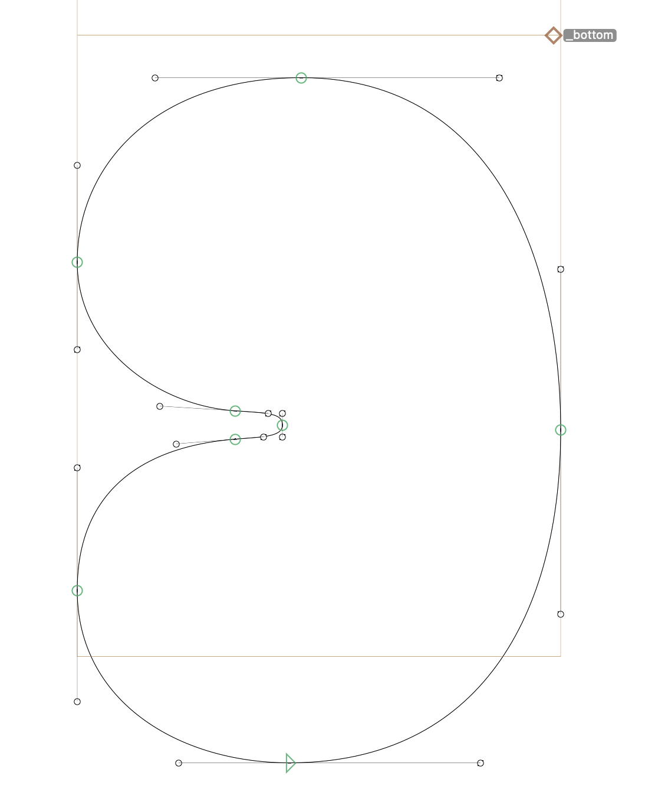
_bottom tone-mark on the top right corner of the image -->

### How to Add Tone-Marks
After double clicking onto a glyph, you will be in that glyph page. You can type _cmd + u_ and the marks will appear in the center of the glyph. Therefore, it is recommended to create a guideline at x=200 and set the character width to 400, so that when checking them later, all the marks will be at the same place.
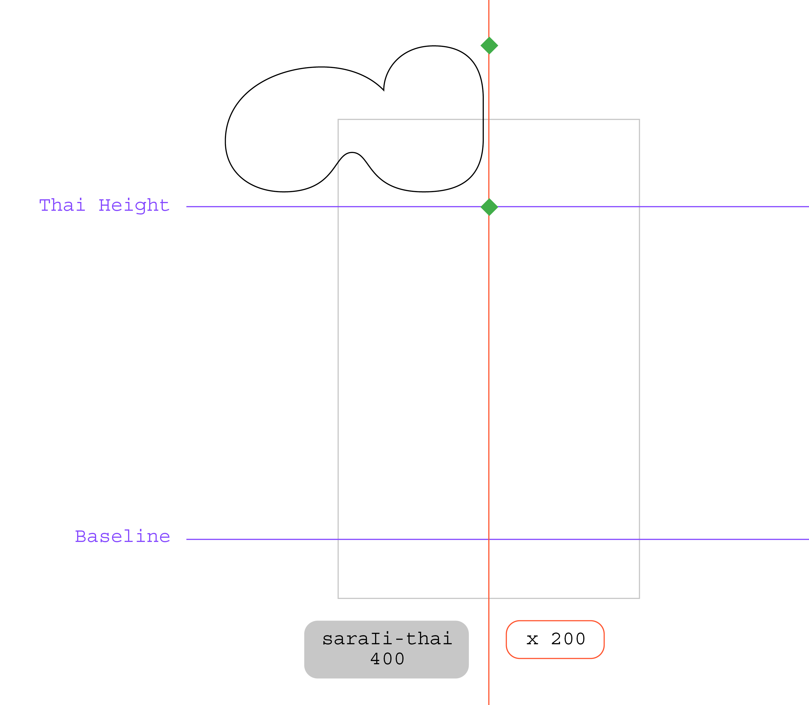

### How to Preview Tone-Marks
What if you want to preview a word or a sentence with correct mark positions? There is a free plugin called *Show Mark Preview* that allows you to display tones and vowels in place in the Edit View using Text tool (T). 

The plugin can be installed through _Window > Plugin Manager_. Then click the taps *All* and *Plugins*. Type in "Show Mark Preview" in the search box and install it.

The Mark Preview can be turned on through _View > check Show Mark Preview_
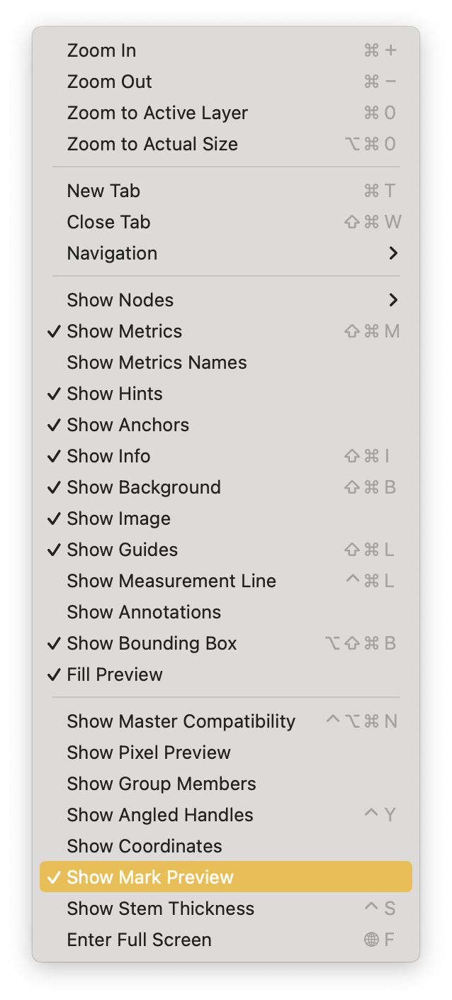

### The Special Case of saraAm
SaraAm when combined with maiTho or maiTri is normally not easy to align, so the solution would be to make new alternate glyphs. This can be done in Grid View by selecting the saraAm glyph then _cmd + d_ or _Glyph > Duplicate Glyph_. SaraAm glyph will be duplicated, and you can adjust the new glyph with maiTho or maiTri.
