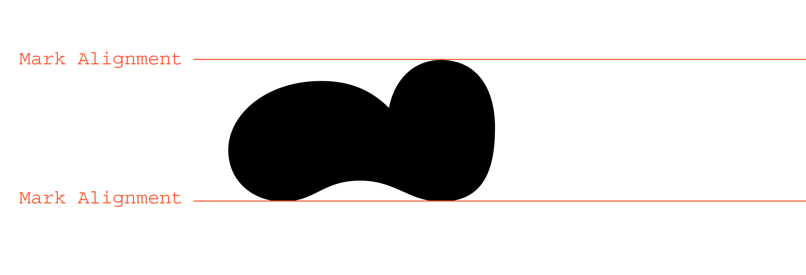
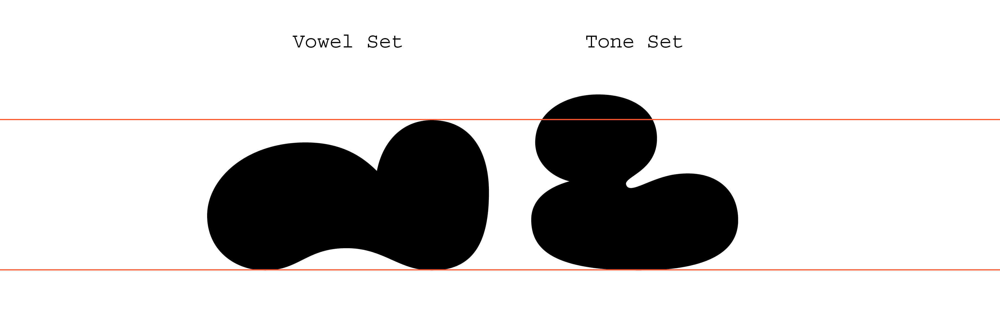
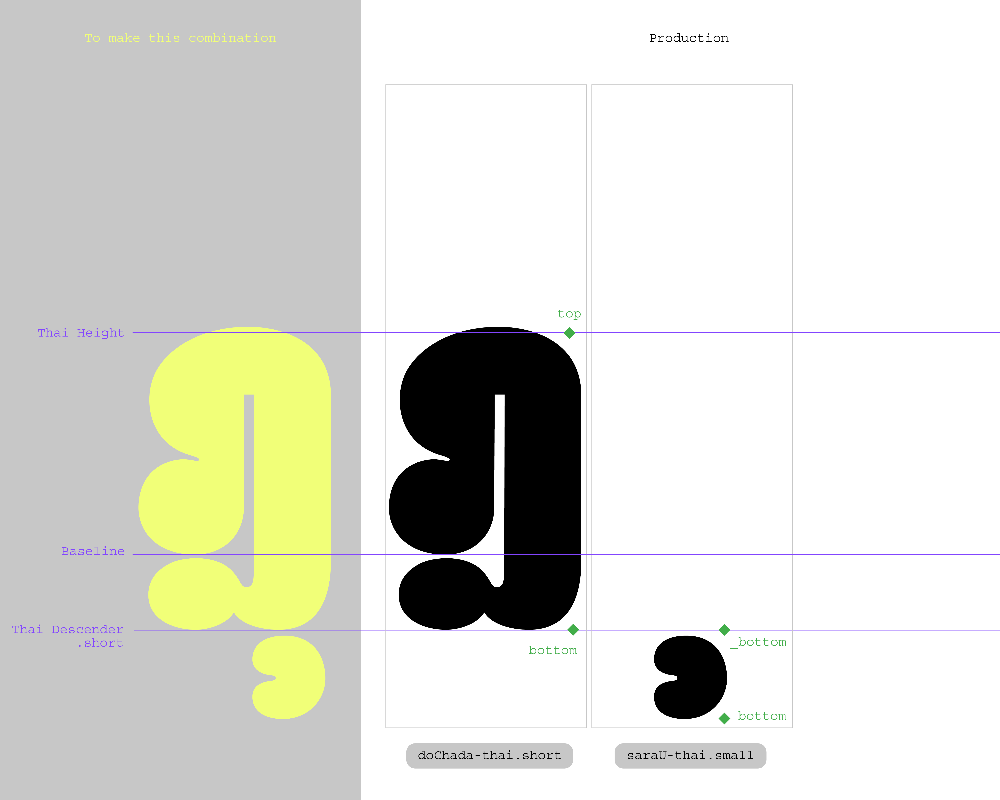

# **How to Thai Glyphs**
## Objective

This guide is intended for beginners who are interested in designing Thai fonts using GlyphsApp. It is specifically written for Thai type designers, and assumes a basic understanding of the Thai script.

We do not go into detail about what Thai consonants, tone marks, or their positions are. Instead, we trust your native eye to guide your design decisions. (Hint: reviewing existing Thai typefaces can help you understand how other designers have approached it.)

There’s no single correct way to create a Thai font — this is just one approach. Feel free to adapt it to your own workflow as needed.

If you find that something is unclear or missing, please don’t hesitate to open an issue or ask a question. We’re happy to improve this guide together.

# 1.  Let’s start by creating a file
We have to add Thai glpyhs into the file! There are two ways of doing this in Glyphs 3: 

1.1 First opening Glyphs App, there will be a window showing different scripts for you to choose which script you want to develop, then select Thai and say _YES_ to _Prepare glyphs_

1.2 We can also navigate to the languages section on the left. Then, we open the dropdown menu under Thai and select the glyphs we want to add from the categories (Letters, Marks, Numerals, etc.). Finally, click “Generate”.

## Note: For first time user
Before diving into editing, there are some modules you need to install for the future plugins to work. You can access them through _Window > Plugin Manager_ 

Then this window will appear. Go to _Modules_ located next to the search box. Then install all 4 modules.Please see more about modules also in [Glyphs 3 Handbook](https://cdn2.glyphsapp.com/media/pages/learn/f84e457b88-1639830290/glyphs-3.0.4-handbook.pdf) (in 3.6 Addons)

# 2. Metric & Alignment Zones for Thai
After we added Thai glyphs into our file, it's time to define body height and alignment zones — please see more about techniccal details explanation in [Glyphs 3 Handbook](https://cdn2.glyphsapp.com/media/pages/learn/f84e457b88-1639830290/glyphs-3.0.4-handbook.pdf). **Thai's height is situated in between Cap Height and x-Height.** 

To do this, you can go to  _Font Info_. Then go to _Masters_ tab, scroll down to _Metrics_ and click the _+_ symbol on the right.

> [!NOTE] 
> If you added Thai glyphs through pre-defined glyphs set via the scripts pop-up window, you will automatically have multiple Metrics preset here. You can choose to keep/ modify/ delete them out as you see fit for your design. 

In this insturction, we would like to keep the metricminimal for ease of understanding. And will only focus on what is necessary. We started by adding the glyphs through method (1.1) 

A new _undefined_ input will appear. Simply click on it, then choose _Body Height_ for the _Metrics type_ and add a _Custom Name_. In this example, I put Thai.

Then you can fill in Thai height and alignment zone. These values can be changed along your development process. They are important also for anchors attachment at Thai height in which we will talk about it more in details in the section below. 

# 3. Start Drawing! 
You will be filling all glyphs with your drawing in most of the sections: Letters, Marks, Numerals and others, please see more about [the drawing tip here](https://glyphsapp.com/learn/drawing-good-paths)

## Marks
After you've done all Letters, now you can start drawing the marks! `saraIi-thai` is usually good for the start as its height usually defines the rest of the height in its set:`saraI-thai` `saraIi-thai` `saraUe-thai` `saraUee-thai`; let's say we call them "vowel set". You can also add guidelines at the top and the bottom of it to easily refer to the baseline and height of `saraIi-thai`.

However, the height of tonal marks or "tone set" such as `maiEk-thai`, `maiTho-thai`, `maiTri-thai`, `maiChattawa-thai`, or even `maitaikhu-thai` should not be limited to the height of `saraIi-thai` since it will not have any other marks to be placed on top, and for the visual compensation — it can grow heigher than the `saraIi-thai` height. Please see an example in the image below.

## Thai tone-marks explanation
In Thai, forming a word can involve multiple tone and vowel marks placed above and below the consonants or letters. Thanks to the current technology : `mark to base` and `mark to mark` Opentype feature. We can now attach marks on top and below letters using "anchor" on letters and on the marks. Please [see more tips here](https://glyphsapp.com/learn/mark-attachment). 

### Top Marks
In Thai font development, a mark usually comes in a set of three: 
1. default (e.g. `maiTho-thai`) is _a first floor mark_ used on top of letters
2. .small (e.g. `maiTho-thai.small`) is _a second floor mark_ used _on top of the first floor mark._ This set of glyphs is also smaller than the default glyphs as well. 
3. .narrow (e.g. `maiTho-thai.narrow`) is _a first floor mark_ used on letters _with ascender_. This set of glyphs is usually narrower than the default glyphs.

An example of maiTho, maiTho.small and maiTho.narrow

An example of maiTho, maiTho.small and maiTho.narrow in use

<!-- 

An example of default maiTho

An example of maiTho.small

An example of maiTho.narrow -->

> [!NOTE]
> * Not all top marks require all three sets. These can be adjusted based on the needs of each typeface. If none of the above fit certain glyphs, it is possible to create additional alternates. For example, you can create “.mid” (middle) width top marks for use with `roRua-thai` or `woWean-thai` in Loopless designs.
> * Default means glyph without additional .small / .narrow after its name or in other words glyph that contains unicode.

### Bottom Marks
In the case of _bottom marks_, there are two sets: 
1. Default glyphs
2. .small is a shorter version of its default to use with letters with descender: ".short" descender letters: `doChada-thai.short` and `toPatak-thai.short`.

An example of saraU and saraU.small

An example of doChada.short and saraU.small in use
<!-- **Change photo same as ส้มนี้ฟ้า** -->

<!-- 
An example of saraU and saraU.small

An example of saraU.small -->

# 4. Anchors attachment
These anchors act like hooks that you can place on each glyph for them to hook to another glyph. Please see [more about anchors here](https://handbook.glyphsapp.com/anchors/). Usually we use Glyphs' shortcut `Command + u` to add the anchors in glyphs. 

> [!NOTE] 
> In Letters, if `top` anchors do not appear on Thai's body height, please check 2. Metric and Alignment 

### Anchors on Letters / Consonants
There are 2 anchors which will be placed on consonants namely `top` and `bottom`. Like their names, `top` is placed on Thai Body Height connecting to the top marks, and `bottom` is placed on the baseline conneccting to the bottom marks. In Thai, we usually place marks align with the right stem of the letters; therefore, you can place anchors at the top/bottom right of each letters/consonants. 

> [!NOTE]
> It is important to note that for curved corners in some letters, anchors sometimes need to be shifted slightly inward (-x) to achieve proper visual compensation and alignment between the letter and the marks.

<!--  -->

### Anchors on marks #1 floor
For the #1 floor top marks, there are also 2 anchors: `top` and `_top`. It is recommended to add marks on the top and bottom of each marks. The one in the bottom, we will place `_top` at the same y position in which we place `top` in Letters which in this case is at Thai Body Height. And then we will place `top` anchor at the very top of the glyph.

Even though some tonal marks, such as `maiTho-thai`, do not grammatically require a `top` anchor since they won’t have any other marks above them, this `top` anchor is attached here to prevent typography errors. It ensures proper stacking in the event of double typing.

### Anchors on marks #2 floor 
For the #2 floor top marks, the process is similar to that of the #1 floor marks. We need the same two anchors: `top` and `_top`. However, this time we will place the `_top` anchor at the height (y) of saraIi-thai. As with the previous floor, we will place the `top` anchor at the very top of the glyph. Please see the image below for a visual explanation.

An example of top anchor placement

### Anchors on marks bottom
Thai's bottom marks are only in 1 level down. And for the bottom marks to connect with the consonant above, we place the anchors in a similar manner as those top marks except that we will call it `bottom` and `_bottom` instead. 

An example of bottom anchor placement

An example of bottom anchor placement

### How to Preview Tone-Marks
What if you want to preview a word or a sentence with correct mark positions? There is a free plugin called [Show Mark Preview](https://github.com/mekkablue/ShowMarkPreview) that allows you to display marks in place in the Edit View using Text tool (T). 

>[!NOTE]
> * Please, install the plug-in through Glyphs's Plug-in Manager 
> * Don't forget to turn it on to see the preview! Show Mark Preview can be turned on through _View > check Show Mark Preview_

# 5. [Extra] Nikhahit set
Practically in Opentype feature, when you type `saraAm-thai` it will decompose the ligature into `nikhahit-thai` and `saraAa-thai`.

Then the #2 floor tonal marks will attach to the anchors position in `nikhahit-thai`. And to make the nice mark positioning on `nikhahit-thai` with other tonal marks, we would recommend you to create additional glyphs in which combined the `nikhahit-thai` and other tonal marks as a componant. Especially, `nikhahit-thai` + `maiTho-thai.small`, and `nikhahit-thai` + `maiTri-thai.small`.

The new glyph can be added through Glyph >> Add Glyphs..., you can name them however you like, in my case I name them `nikhahit_maiTho-thai` and `nikhahit_maiTri-thai`. And then add Componant of `nikhahit-thai` + `maiTho-thai.small`, for example. And right click to `disable automatic alignment` and the you can freely adjust their position. 

An example of nikhahit_maiTho-thai

>[!NOTE]
> Please make sure that the name of this ligature you set and what you wrote in the OpenType feature is the same name. Otherwise, those substitution will not work. 

# 6. Thai OpenType feature
Thai OpenType features are important, it is important to make Thai tone-marks in Thai function properly. Majority of Thai OpenType features take place in [ccmp](https://learn.microsoft.com/en-us/typography/opentype/spec/features_ae). In Glyphs 3, you can automatically generate Thai features within a click. However, you can also modified them according to your design. 

> [!NOTE]
> * [Here](https://github.com/boomwooq/Thai_Opentype_feature) I share the example of my OpenType feature of mine in Both Thai Loop and Loopless.
> * You can also look moe information about OpenType features at 
>>* [Features, part 1: simple sub­stitutions](https://glyphsapp.com/learn/features-part-1-simple-substitutions)
>>* [Features, part 2: con­textual sub­sti­tutions](https://glyphsapp.com/learn/features-part-2-contextual-substitutions) 
>>* [Features, part 3: advanced contextual alternates](https://glyphsapp.com/learn/features-part-3-advanced-contextual-alternates) 
>>* [Features, part 4: positional alternates](https://glyphsapp.com/learn/features-part-4-positional-alternates)
>> * [OpenType Cookbook](https://opentypecookbook.com)

